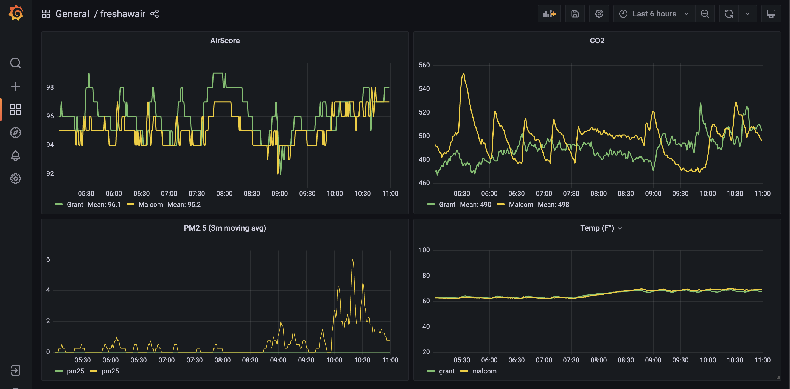

# freshawair

Store your Awair data locally.
Access your Awair data from a user hosted web-app.

## description

`freshawair` is four macro components

- `ui` - a web application
- `agent` - captures data from your awair and forwards it to your `server`
- `server` - takes agent data, stores it in the db. hosts the `ui`, and hosts api to access db data.
- `db` - [timescale db](https://www.timescale.com/) instance

## usage

At current time, even though there are [docker images](https://hub.docker.com/repository/docker/cdaringe/freshawair), the only supported mechanism for build is following:

- install [rad](https://github.com/cdaringe/rad#install)
- `rad -l info uibuild`
- `docker-compose build --parallel`
- `docker-compose up`
